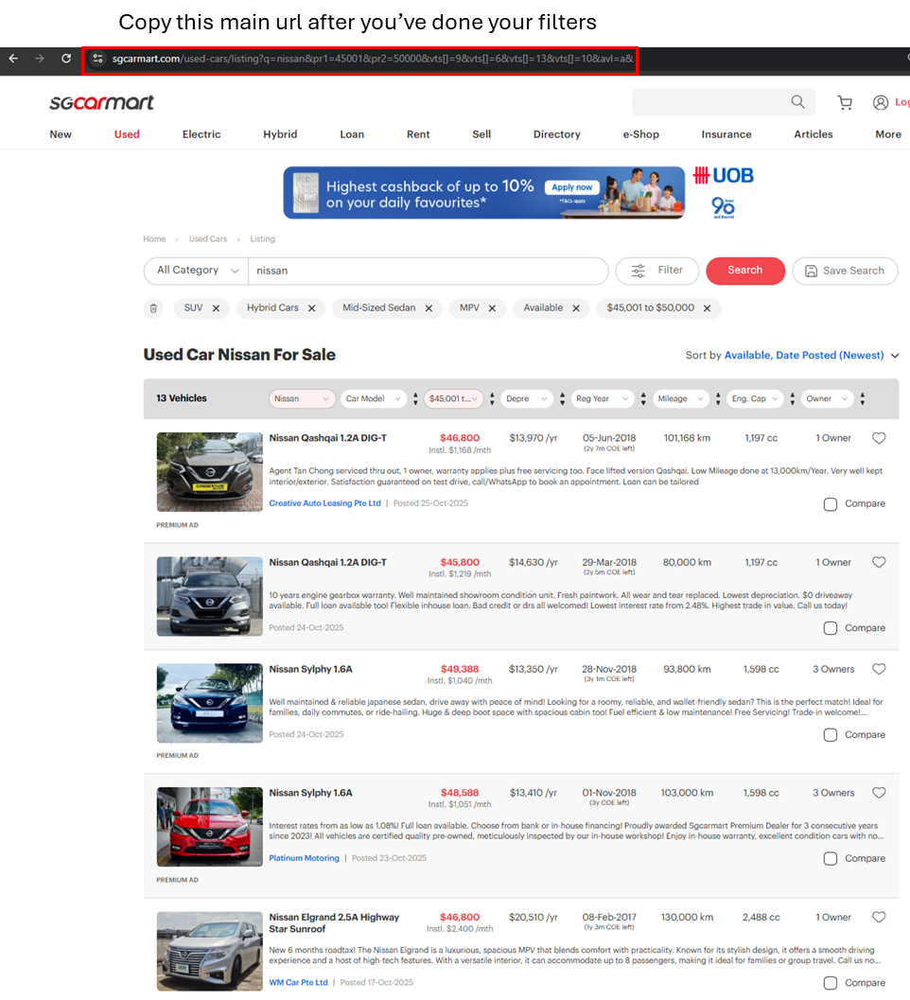

# webscrap_sgcarmart

**Prerequisite:**  
You need to have Python installed.  
Download Python 3.10.11 from [python.org](https://www.python.org/downloads/release/python-31011/).

**Quick Start:**  
Just run `install_run.bat` to install dependencies and start scraping.

---

## What does this project do?

This script automates web scraping of car listings and processes their details, making it easy to collect, clean, and analyze Singapore car market data.

### How `main.py` works

- **User input:**  
  You'll be prompted for a `car listing URL` and the `maximum number of pages to scrape` for safety reasons.

- **Scraping:**  
  It collects all relevant car listing links found across the provided number of pages.

- **Details extraction:**  
  For each listing, the script attempts to extract detailed information, retrying a few times if extraction fails.

- **Data storage:**  
  Each car's details are appended to a local CSV file that is named "carlist_***". If no CSV exists yet, it creates one.

- **Processing:**  
  After scraping, it automatically:
  - Parses and cleans the raw data
  - Converts registration dates to datetime formats (handles various date styles robustly)
  - Calculates:
    - How many years and months a car has left before its standard deregistration
    - Financial values such as ARF (Additional Registration Fee), estimated PQP (Prevailing Quota Premium), potential net values for ownership extension, and monthly consumption worth
  - Removes duplicate entries
  - Exports a processed dataset CSV

- **Final Output:**  
  The processed CSV appears in the `data` folder, ready for further analysis.

---

Just double-click or run `install_run.bat` and follow the prompts!

For further details, see the comments inside `main.py`.
