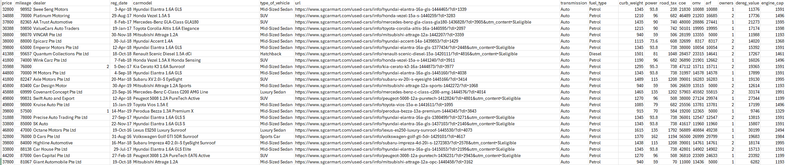

# webscrap_sgcarmart

**Prerequisite:**  
You need to have Python installed.  
Download Python 3.10.11 from [python.org](https://www.python.org/downloads/release/python-31011/).

**Quick Start:**  
Just run `install_run.bat` to install dependencies and start scraping.

---

## What does this project do?

This script automates web scraping of car listings and processes their details, making it easy to collect, clean, and analyze Singapore car market data.

### How `main.py` works

- **User input:**  
  You'll be prompted for a `car listing URL` and the `maximum number of pages to scrape` for safety reasons.

- **Scraping:**  
  It collects all relevant car listing links found across the provided number of pages.

- **Details extraction:**  
  For each listing, the script attempts to extract detailed information, retrying a few times if extraction fails.

- **Data storage:**  
  Each car's details are appended to a local CSV file that is named "carlist_***". If no CSV exists yet, it creates one.

- **Processing:**  
  After scraping, it automatically:
  - Parses and cleans the raw data
  - Converts registration dates to datetime formats (handles various date styles robustly)
  - Calculates:
    - How many years and months a car has left before its standard deregistration
    - Financial values such as ARF (Additional Registration Fee), estimated PQP (Prevailing Quota Premium), potential net values for ownership extension, and monthly consumption worth
  - Removes duplicate entries
  - Exports a processed dataset CSV

- **Final Output:**  
  The processed CSV appears in the `data` folder, ready for further analysis.

---

| Column Name                 | Description / Use                                                                                                                                             |
|-----------------------------|---------------------------------------------------------------------------------------------------------------------------------------------------------------|
| price                       | Listing price of the car (in SGD)                                                                                                                            |
| transmission                | Gearbox type (e.g., Auto, Manual, others)                                                                                                                    |
| fuel_type                   | Fuel used by the vehicle (e.g., Petrol, Diesel)                                                                                                              |
| curb_weight                 | Unladen weight of the car (kg)                                                                                                                               |
| power                       | Engine output (usually in horsepower or kW)                                                                                                                  |
| road_tax                    | Annual road tax applicable (SGD)                                                                                                                             |
| coe                         | Original COE (Certificate of Entitlement) paid (SGD)                                                                                                        |
| omv                         | OMV - Open Market Value, declared import value (SGD)                                                                                                         |
| arf                         | ARF - Additional Registration Fee paid (SGD)                                                                                                                 |
| mileage                     | Total distance car has travelled (km)                                                                                                                        |
| owners                      | Number of unique owners the car has had                                                                                                                      |
| dealer                      | Name of the listed car dealer or seller                                                                                                                      |
| dereg_value                 | Estimated future deregistration value (SGD)                                                                                                                  |
| engine_cap                  | Engine capacity (cc)                                                                                                                                         |
| reg_date                    | The vehicle's date of first registration                                                                                                                     |
| carmodel                    | Name/model variant of the car                                                                                                                                |
| type_of_vehicle             | Classification (e.g., Sedan, SUV, Hatchback, etc.)                                                                                                           |
| url                         | URL to car's full listing on Sgcarmart                                                                                                                       |
| years_months_left           | Time left till standard 10-year deregistration (in "X yr Y mth" format or "Expired")                                                                         |
| ARF_val                     | Parsed numeric ARF for computations                                                                                                                          |
| dereg_val_at_10y            | Projected deregistration value at end of 10 years (SGD)                                                                                                      |
| pqp_est_10y                 | Estimated PQP (Prevailing Quota Premium) needed to extend COE for 10 years                                                                                   |
| pqp_est_5y                  | Estimated PQP needed to extend COE for 5 years                                                                                                               |
| extend_net_value_10y        | Financial net value if COE is renewed for 10 years (dereg_val_at_10y - pqp_est_10y)                                                                          |
| extend_net_value_5y         | Financial net value if COE is renewed for 5 years (dereg_val_at_10y - pqp_est_5y)                                                                            |
| cost_minus_dereg            | How much above (or below) the car’s deregistration value you are paying (price - dereg_val_at_10y)                                                           |
| monthly_consumption_worth   | Approximates car's “depreciation” cost per remaining month: (cost_minus_dereg divided by number of months to 10-year dereg)                                  |

---

Just double-click or run `install_run.bat` and follow the prompts!

For further details, see the comments inside `main.py`.
